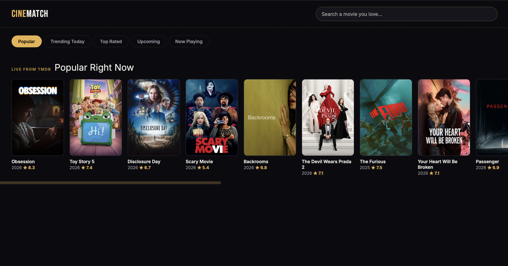
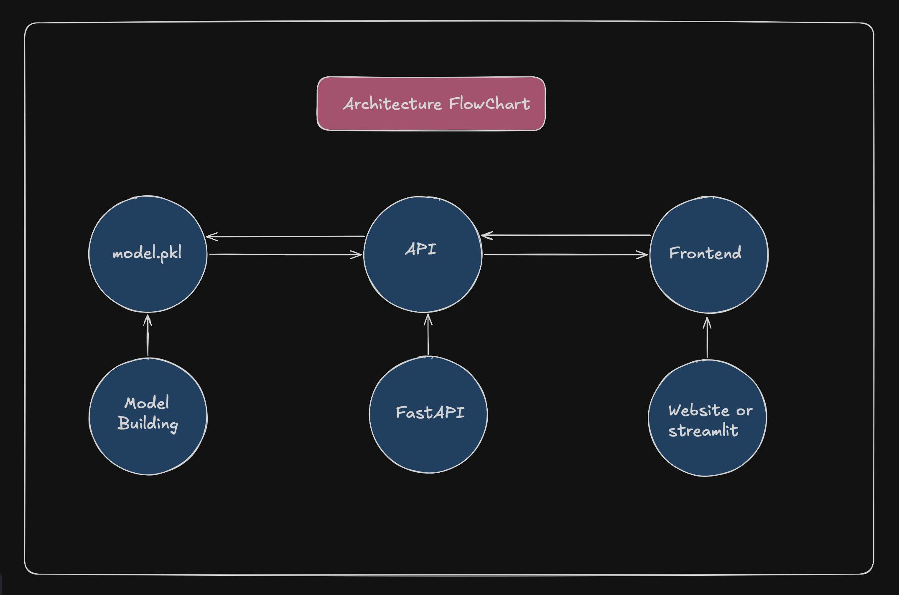

# CineMatch - Movie Recommender
>Live Link : https://movierecommendationsystem-production-61c8.up.railway.app

## Overview

The following picture illustrates the CineMatch Landing Page Overview.

<p align="center">
    
</p>


## System Architecture

The following diagram illustrates the high-level architecture of the Movie Recommendation System.

It demonstrates how the frontend communicates with the FastAPI backend, which loads the trained machine learning artifacts and performs recommendation generation before returning the results to the client.

<p align="center">
    
</p>

### Architecture Overview

The application follows a modular three-layer architecture.

```
┌─────────────────────────────────────────────┐
│                 Frontend                    │
│      HTML • CSS • JavaScript                │
└─────────────────────────────────────────────┘
                    │
                    │ HTTP Request
                    ▼
┌─────────────────────────────────────────────┐
│              FastAPI Backend                │
│                                             │
│ • REST API                                  │
│ • Recommendation Engine                     │
│ • Similarity Search                         │
│ • Data Processing                           │
└─────────────────────────────────────────────┘
                    │
                    ▼
┌─────────────────────────────────────────────┐
│          Machine Learning Artifacts         │
│                                             │
│ • TF-IDF Vectorizer                         │
│ • TF-IDF Matrix                             │
│ • Metadata Dataset                          │
│ • Movie Index Mapping                       │
└─────────────────────────────────────────────┘
```

---

### Request Flow

1. User searches for a movie.
2. The frontend sends an HTTP request to the FastAPI server.
3. FastAPI validates the request.
4. The recommendation engine locates the selected movie.
5. Cosine similarity scores are computed using the TF-IDF matrix.
6. Top matching movies are selected.
7. Movie metadata is retrieved.
8. Results are returned as JSON.
9. The frontend displays the recommendations.

---

## Recommendation Pipeline

```
Movie Name
     │
     ▼
Frontend
     │
     ▼
FastAPI Endpoint
     │
     ▼
Movie Lookup
     │
     ▼
TF-IDF Similarity Search
     │
     ▼
Rank Movies
     │
     ▼
Fetch Metadata
     │
     ▼
Return Top Recommendations
     │
     ▼
Display Results
```

The recommendation engine is entirely content-based. Instead of relying on user ratings or collaborative filtering, it analyzes textual movie metadata and computes cosine similarity between TF-IDF vectors to identify movies with similar content.

---

## Deployment

The application has been containerized using Docker and deployed on Railway.

### Deployment Stack

| Component | Technology |
|-----------|------------|
| Backend | FastAPI |
| Frontend | HTML, CSS, JavaScript |
| Web Server | Uvicorn |
| Containerization | Docker |
| Hosting Platform | Railway |
| Version Control | Git & GitHub |

The Docker image encapsulates all dependencies required for execution, ensuring consistent deployment across environments.

---

## Features

- Content-Based Movie Recommendation System
- FastAPI REST API
- Interactive Web Interface
- Dockerized Application
- Railway Deployment
- TF-IDF Based Similarity Search
- Cosine Similarity Recommendation Engine
- Modular Project Structure
- RESTful API Design
- Responsive Frontend
- Environment Variable Support
- Production Ready Deployment

---

## API Endpoints

| Method | Endpoint | Description |
|---------|----------|-------------|
| GET | / | Home Page |
| GET | /health | Health Check |
| GET | /movies | Returns Movie List |
| POST | /recommend | Generate Recommendations |

---

## Future Improvements

- User Authentication
- Personalized Recommendations
- Collaborative Filtering
- Hybrid Recommendation System
- Movie Posters Integration
- User Rating System
- Watchlist Support
- Recommendation History
- Redis Caching
- PostgreSQL Integration
- Kubernetes Deployment
- CI/CD Pipeline using GitHub Actions

## Author

- Arzaan NITH

